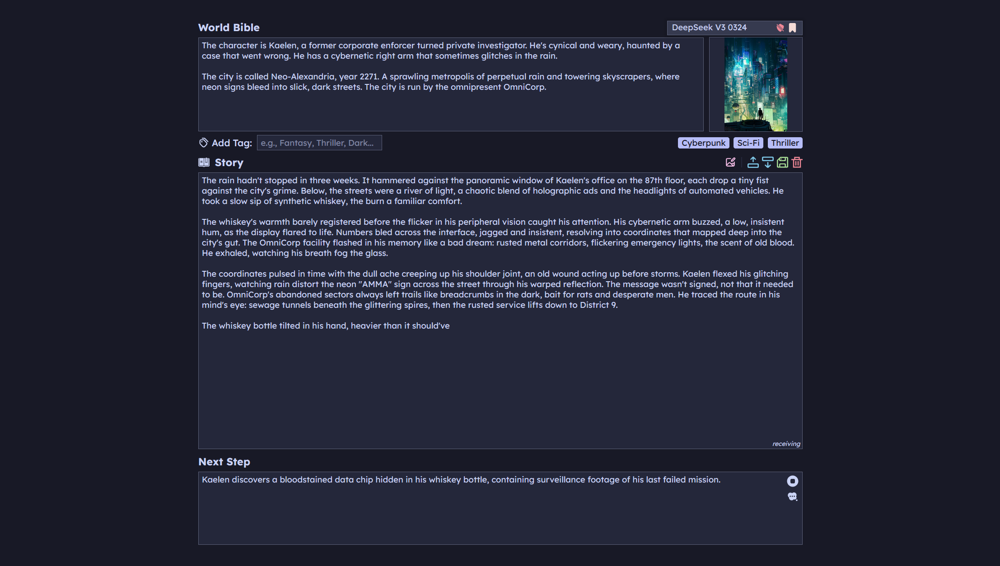
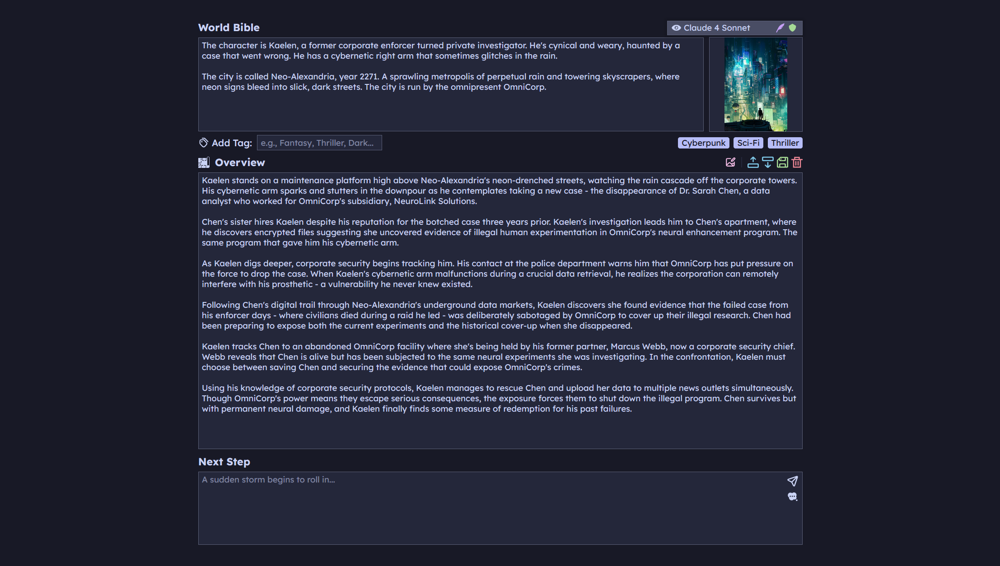
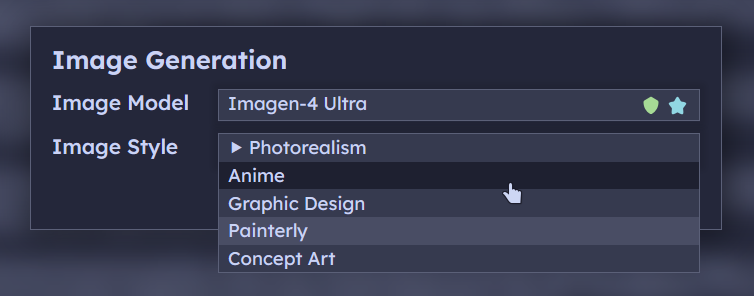

# StoryGo



StoryGo is a creative writing assistant powered by AI. It's designed to help writers, storytellers, and game masters develop their ideas, overcome writer's block, and accelerate the creative process. With a simple and intuitive interface, StoryGo acts as your collaborative partner, turning your concepts into compelling narratives.

## Who is StoryGo for?

- **Novelists & Authors** who want to brainstorm plot points or write drafts faster.
- **Game Masters & Dungeon Masters** who need to quickly generate scenarios, characters, and world lore.
- **Screenwriters** looking to outline acts and develop scenes.
- **Hobbyists & Enthusiasts** who love creating stories and want a powerful tool to explore their imagination.

## Features

- **AI-Powered Generation:** Create rich and detailed story content based on your context and direction, one paragraph at a time. The AI seamlessly continues your narrative, matching your established tone.
- **Story Overview Mode:** Quickly generate a high-level overview of your entire story. Flesh out a logline, character arcs, and a three-act plot structure before you write a single line of prose.



- **AI-Powered Suggestions:** Overcome writer's block with intelligent suggestions for your story's next step, powered by a dedicated brainstorming AI.
- **Context and Direction:** Guide the AI with a "World Bible" (context) and a "Next Step" (direction) to maintain consistency and control the narrative.
- **Image Generation:** Bring your narrative to life by generating stunning images based on the current moment in your story. Choose from a variety of models and styles to create the perfect visual.



- **Vision-Based Inspiration:** Use any image as a creative anchor. Vision-capable models analyze the image directly, while non-vision models use a detailed text description.
- **Curated Model Selection:** Choose from a carefully selected list of top-tier AI models, each with its own strengths—from unmoderated creativity to literary polish.
- **Export to PDF:** Save your stories as beautifully formatted PDF files, ready for sharing and printing.

## Power Features

- **Keybinds for Efficiency:**
  - `Ctrl+Enter`: Generate/Suggest.
  - `Tab`: Continue the current line of text without a paragraph break.
  - `Ctrl+S`: Save the story as a PDF.
- **JSON Import/Export:** Save your entire session (story, context, image, etc.) to a JSON file and load it back in later.

## Installation

You can run StoryGo in two ways: by downloading a prebuilt release or by compiling it from source.

### Prebuilt Releases (Recommended)

The easiest way to get started is to download the latest prebuilt release for your operating system and architecture from the [Releases page](https://github.com/coalaura/storygo/releases).

After downloading, simply run the executable.

### From Source (for Developers)

If you prefer to compile the application yourself, you'll need to have Go installed.

1. **Clone the repository:**
```bash
git clone https://github.com/coalaura/storygo.git
cd storygo
```

2. **Install dependencies:**
```bash
go mod tidy
```

3. **Set up your environment variables:**
  - Rename the `.example.env` file to `.env`.
  - Open the `.env` file and add your API keys and custom model configurations:
```env
# Your openrouter.ai token (required)
OPENROUTER_TOKEN="your-openrouter-api-key"

# Your replicate.com api token (required for image generation)
REPLICATE_TOKEN="your-replicate-api-key"

# Model to use for image descriptions (defaults to `qwen/qwen2.5-vl-32b-instruct`)
VISION_MODEL=""

# Model to use for generating image prompts (defaults to `deepseek/deepseek-chat-v3-0324`)
IMAGE_PROMPT_MODEL=""

# Use compatibility mode for the vision model (e.g., for models that don't support webp)
VISION_MODEL_USE_COMPATIBILITY=false
```

4. **Run the application:**
```bash
go run .
```

The application will be available at `http://localhost:3344`.

## Technology Stack

- **Backend:** Go
- **Frontend:** Vanilla JavaScript, HTML, CSS
- **PDF Generation:** jsPDF

## License

This project is licensed under the MIT License. See the [LICENSE](LICENSE) file for details.